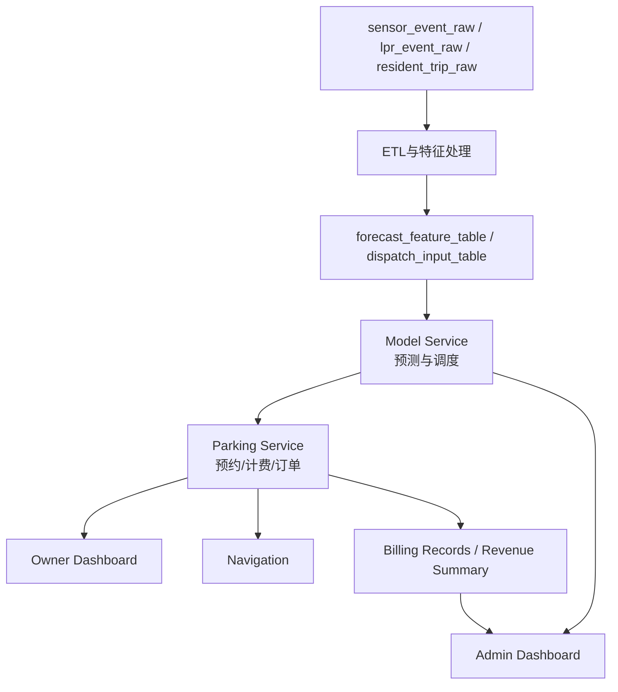
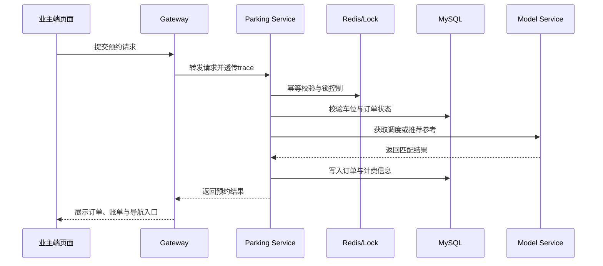
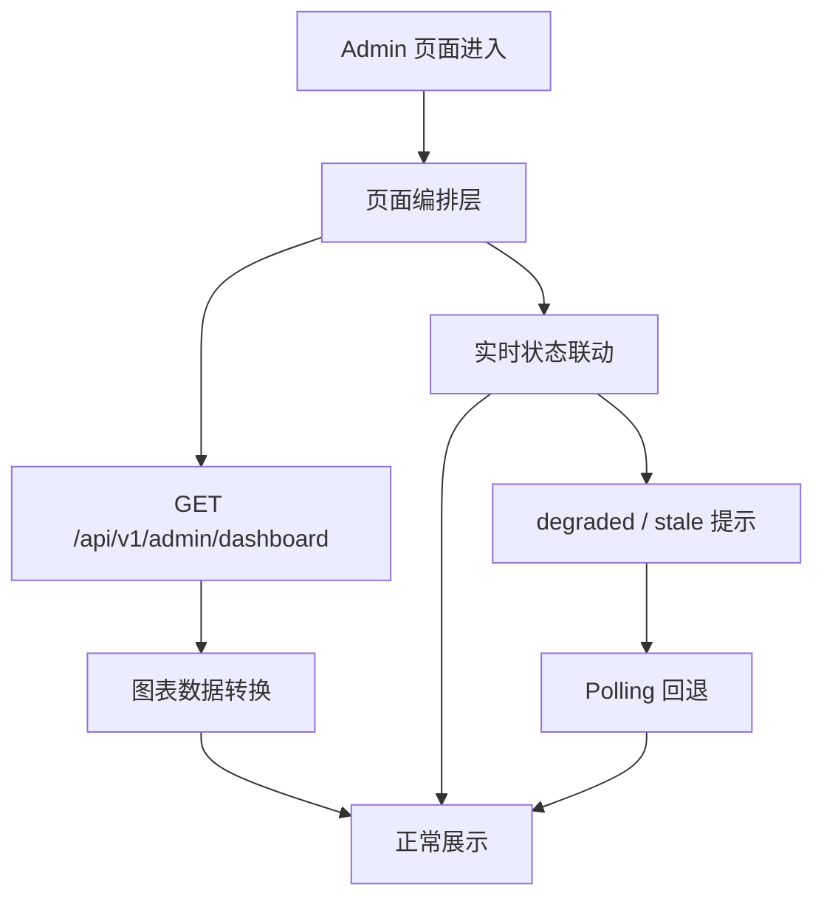
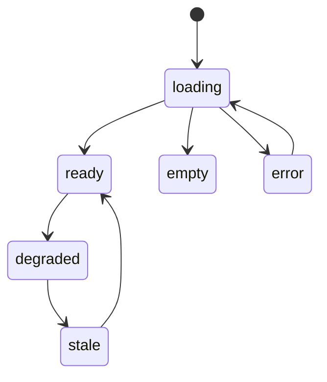
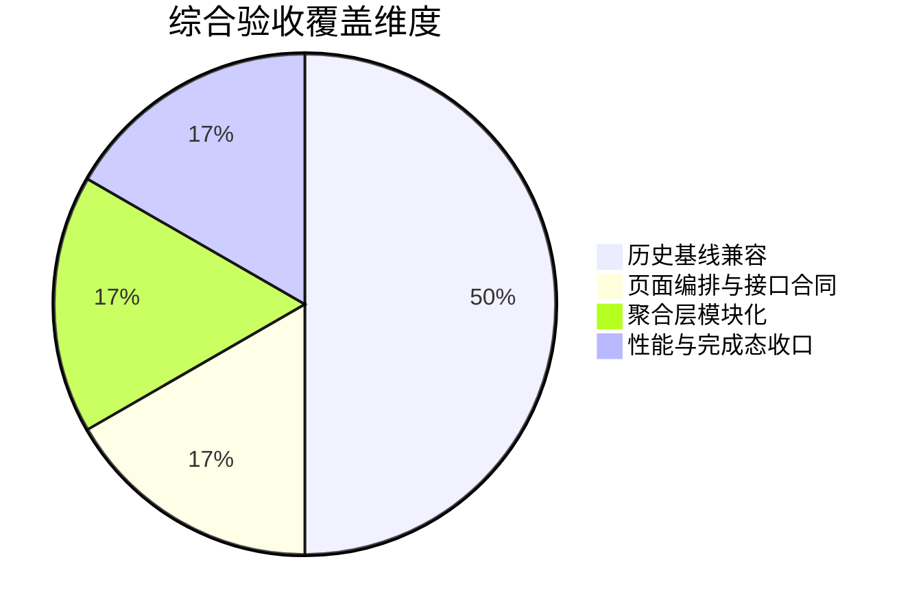

# 本科毕业设计说明书

## 中文题目

智慧社区多源数据融合的车位动态调度与共享系统设计

## 英文题目

Design of a Dynamic Parking Dispatch and Sharing System for Smart Communities Based on Multi-Source Data Fusion

## 学院（部）

数学与大数据学院

## 专业

数据科学与大数据技术

## 班级

数据科学与大数据技术21-4

## 学号

2021300619

## 学生姓名

陈苏烨

## 指导教师

任丹丹

## 职称

副教授

## 届别

2026届

## 完成日期

2026 年 5 月 25 日

## 摘要

随着社区机动车数量持续增长，停车资源紧张、空闲车位利用不足、停车信息更新滞后等问题越来越突出。很多社区虽然并不是绝对缺少车位，但由于车位状态、住户出行时间和共享规则之间缺少统一组织，常常会出现车主在场内反复寻找车位、物业难以及时掌握经营情况的现象。围绕这一实际问题，本文设计并实现了一套面向智慧社区场景的多源数据融合车位动态调度与共享系统。

本系统采用前后端分离与微服务结合的总体架构，后端由网关服务、停车主业务服务、模型服务和实时服务组成，前端包括业主端和物业端两类业务页面。系统以车位状态数据、车辆进出记录和住户出行规律数据为基础，通过数据清洗、字段对齐和特征构建形成预测与调度输入；在模型层使用轻量化 LSTM 方法估计供需变化，在调度层利用 Hungarian 方法完成车位匹配；在业务层打通推荐、预约、订单、计费、导航和经营监控链路；在工程层加入幂等控制、锁机制、轮询回退和统一页面状态提示等设计。

从系统验证结果来看，项目已经形成较完整的业务闭环，能够支持业主端推荐预约与导航流程，也能够支持物业端经营摘要、趋势图表和状态说明展示。本文更关注把数据融合、需求预测、资源调度和业务页面组织成一套可解释、可复现的毕业设计系统，而不是单独追求复杂算法或夸大实验指标。论文工作说明了智慧社区停车问题不仅是算法问题，也是一项需要数据、服务和界面协同完成的系统工程。

关键词：智慧社区停车；多源数据融合；LSTM；Hungarian算法；微服务

## ABSTRACT

With the continuous growth of vehicle ownership in residential communities, parking management faces practical problems such as tight parking resources, low utilization of idle spaces, and delayed status updates. In many cases, the core issue is not the absolute shortage of parking spaces, but the lack of coordinated scheduling among parking-slot status, resident travel demand, and sharing rules. To address this problem, this thesis designs and implements a dynamic parking dispatch and sharing system for smart communities based on multi-source data fusion.

The system adopts a frontend-backend separated architecture combined with microservices. Its backend includes gateway, parking-service, model-service, and realtime-service, while the frontend provides owner-side and admin-side interfaces. Multi-source parking-related data, including parking-slot status, vehicle entry and exit records, and resident travel patterns, are cleaned, aligned, and transformed into forecasting and dispatch inputs. A lightweight LSTM-based method is used to estimate supply-demand change, and the Hungarian method is applied to parking allocation. On the business side, the system supports recommendation, reservation, order processing, billing, navigation, and operational monitoring. On the engineering side, idempotency control, locking, polling fallback, and unified page-state presentation are incorporated.

The implementation and acceptance results show that the project has formed a relatively complete business loop. It can support owner-side parking recommendation, reservation, billing, and navigation, while also providing admin-side operational summaries, trend charts, and runtime explanations. This thesis focuses on integrating data fusion, demand prediction, resource dispatch, and user-facing workflows into one explainable and reproducible undergraduate project rather than emphasizing overly complex algorithms or exaggerated metrics. The study indicates that smart community parking is not only an algorithmic problem but also a system engineering task requiring coordination among data, services, and interfaces.

KEYWORDS: smart community parking, multi-source data fusion, LSTM, Hungarian method, microservices

## 目录

摘要
ABSTRACT
1 绪论
1.1 研究背景
1.2 研究意义
1.3 国内外研究现状
1.4 本文主要研究内容
2 相关技术与理论基础
2.1 微服务架构与前后端分离
2.2 多源数据融合
2.3 轻量级时序预测方法
2.4 Hungarian 动态调度方法
2.5 实时交互与系统可靠性技术
3 系统需求分析与总体设计
3.1 系统角色与业务场景分析
3.2 功能需求分析
3.3 非功能需求分析
3.4 系统总体架构设计
3.5 数据流与业务流设计
4 系统详细设计与实现
4.1 服务划分与技术选型
4.2 多源数据接入与处理实现
4.3 预测与调度服务实现
4.4 预约、计费与订单主链实现
4.5 业主端页面实现
4.6 物业端页面实现
4.7 可靠性与降级设计
5 系统测试与结果分析
5.1 测试依据与环境说明
5.2 数据与模型验证
5.3 业务闭环验证
5.4 前端工程化与页面表现验证
5.5 综合验收结果分析
6 结论
6.1 主要结论
6.2 不足与展望
参考文献
致谢

## 1 绪论

### 1.1 研究背景

随着城市化水平不断提高，居民日常出行越来越依赖私家车，停车问题也从过去单一的“车位不足”逐渐演变为“车位信息难获取、共享资源难利用、停车过程不连贯”等复合性问题。已有研究指出，智慧停车系统的核心任务不仅是感知空闲车位，还包括车位信息发布、停车引导、资源分配和用户交互等多个环节[1-3]。这说明停车问题本质上已经不再只是静态资源统计问题，而是一个需要实时信息、业务规则和用户服务共同参与的系统问题。

在社区场景中，这种矛盾表现得更加明显。一方面，住户停车需求具有明显的时间波动，早晚高峰、节假日、访客来访等场景都会造成区域性紧张；另一方面，社区内部往往存在临时空闲车位、共享车位和短时空档，但这些资源如果没有被及时感知和组织，就难以真正服务于停车需求[1][2]。因此，很多社区出现的不是绝对意义上的“无位可停”，而是车位利用不均衡、信息更新不及时和流程协同不足。

从智慧社区建设的角度看，停车管理已经逐渐成为社区数字治理的重要组成部分。物业管理人员除了关心当前有没有空位，还关心收益变化、占用率趋势、异常状态和调度效果。单纯展示一个静态车位列表，已经很难满足社区运营场景的实际需要。国外关于实时停车引导和资源分配的研究已经开始关注用户体验与运营协同问题，例如实时停车引导系统和动态资源分配策略都强调停车过程的连续性[3][4]。因此，围绕社区停车建立一套兼顾数据、调度和页面体验的系统，具有较强的现实针对性。

### 1.2 研究意义

本课题的研究意义首先体现在实际应用层面。对于业主用户来说，如果系统能够及时给出可理解的推荐车位、明确的预约结果、清晰的账单提示和方便的导航入口，就能够缩短找位时间，减少无效绕行，提高停车过程的确定性。对于物业管理人员来说，如果系统能够把收益、占用率、趋势变化和异常状态汇总到统一页面上，也有利于更直观地掌握停车资源利用情况，从而提升社区停车管理效率[1][3]。

其次，本课题在工程实现层面也具有一定意义。现有不少停车类项目更偏向单一方向，例如有的只做车位识别，有的只做数据预测，有的则以简单页面演示为主。相比之下，本文尝试把多源数据处理、需求预测、动态调度、预约计费、地图导航和物业监控放在同一套系统中完成，这更能体现数据科学与软件工程知识在毕业设计中的综合运用。通过这种方式，课题不仅有页面展示，也有相对完整的业务闭环。

最后，从本科毕业设计训练目标来看，这一选题能够较好地覆盖需求分析、系统设计、算法实现、接口组织、页面编排和测试验证等多个环节。它既保留了实际应用场景，也具备适合毕业论文展开分析的系统性内容。通过该课题的完成，可以把课堂上学习的数据处理、数据库、Web 开发、软件工程和算法基础知识落到一个统一场景之中，使论文内容更完整，也更具有可说明性。

### 1.3 国内外研究现状

从国外研究情况来看，智慧停车领域已经形成了较为清晰的研究脉络。Lin 等将智慧停车解决方案归纳为感知、通信、决策与服务等多个层面，说明停车系统的有效性不仅取决于底层传感设备，也取决于上层信息组织方式[1]。Diaz Ogás 等进一步对智慧停车系统进行了综述，指出停车系统需要同时解决状态识别、信息传播和用户服务问题[2]。Al-Turjman 等则从物联网城市建设角度总结了智慧停车在感知方式、网络协同和系统部署上的典型路线[3]。这些研究说明，停车系统正在从单点设备应用逐步转向城市或社区层面的平台化组织。

在停车业务实现方面，已有研究开始强调动态资源分配和停车引导的重要性。Yang 等提出的 iParking 系统将实时监测与引导结合起来，使车主能够更快定位可用车位[4]。这一类研究表明，停车服务如果只停留在车位展示阶段，难以真正解决用户在找位、预约和抵达过程中的连续性问题。对社区停车来说，这种连续性尤为重要，因为车主实际关注的是“能否顺利完成一次停车”，而不是单独看到一张空位表。

在多源数据融合方面，研究者普遍认为单一数据源很难稳定刻画真实环境。Hall 和 Llinas 在多传感器数据融合研究中指出，不同来源数据的互补可以提升系统对复杂场景的描述能力[5]。Khaleghi 等进一步总结了多源数据融合在不确定性处理和信息层次组织上的常见方法[6]。落实到停车场景中，Yamada 等利用多台 3D-LiDAR 估计车位状态，说明空间感知、时间同步和多源信息互补已经成为停车状态识别的重要方向[7]。因此，停车系统如果希望提升判断稳定性，仅依赖单一车位表或瞬时状态往往是不够的。

在预测与调度方面，国外研究已经形成较多成果。Vlahogianni 等提出实时停车预测系统，用于帮助城市管理者和驾驶员理解短时停车变化趋势[8]；Caicedo 等从实时车位可用性预测角度研究了停车状态变化问题[9]；Klappenecker 等则关注停车推荐和可用车位发现对出行体验的影响[10]。随着深度学习的发展，Yang 等将多种时空数据共同引入停车占用预测任务，说明多源特征有助于提升停车需求预测的表达能力[11]。LSTM 作为处理时序数据的重要模型，在停车预测类研究中也被广泛采用，其核心思想是通过门控结构保留时间依赖信息[12]。Gutmann 等在停车占用预测研究中也验证了序列模型与传统方法结合的有效性[13]。

总体来看，现有研究已经为智慧停车提供了较成熟的理论与方法基础，但在本科毕业设计常见的实现范围内，仍然存在两个明显不足。第一，很多研究更关注单一算法效果，和实际业务流程之间的连接不够紧密，难以直接映射到预约、账单和导航等具体流程。第二，不少项目的前端展示仍偏向功能堆叠，对状态解释、页面一致性和异常场景处理关注不足。基于这些情况，本文选择从社区场景出发，把多源数据融合、轻量化预测、确定性调度和双端业务页面结合起来，重点解决“能不能形成闭环”和“能不能被清楚展示”两个问题。

### 1.4 本文主要研究内容

围绕上述问题，本文首先完成了智慧社区停车场景下的需求分析与总体设计，明确了业主用户和物业管理人员两类核心角色，梳理了推荐、预约、订单、计费、导航和经营监控等主要业务流程，并据此确定了系统的服务边界、接口组织方式和页面结构。

其次，本文围绕停车主链完成了多源数据接入、预测与调度设计。通过整理车位状态数据、车辆进出记录和住户出行规律信息，形成预测和调度所需的数据基础；再利用时序预测方法对供需变化进行估计，并通过 Hungarian 方法完成车位匹配，为后续预约和经营分析提供支撑。

再次，本文实现了业主端和物业端两类主要页面。业主端重点解决推荐、预约、账单和导航之间的信息连续性问题，物业端重点解决经营摘要、趋势图表、异常提示和诊断信息的统一展示问题。页面结构延续系统既有路由组织，但在信息层级、状态表达和交互连贯性方面进行了更完整的收敛。

最后，本文根据系统已有的接口合同、项目文档和综合验收结果，对数据、业务和前端表现进行测试分析，总结系统的完成情况、存在不足和后续可以继续完善的方向，为毕业论文形成相对完整的论证基础。

## 2 相关技术与理论基础

### 2.1 微服务架构与前后端分离

微服务架构强调按照业务职责对系统进行拆分，使不同模块能够围绕明确边界独立演进。Newman 认为，微服务的关键价值在于让服务边界与业务能力相对应，从而降低大型系统在迭代过程中的耦合度[16]。Richardson 也指出，微服务模式的真正意义不只是把系统切小，而是在接口、数据和运行治理层面形成清晰边界[17]。对于智慧停车系统来说，停车预约、网关治理、模型计算和实时状态同步本身就具有不同的职责，因此采用微服务组织更容易进行结构化实现。

前后端分离则进一步把页面展示和业务处理解耦。传统单体页面往往把页面结构、交互逻辑和后端模板耦合在一起，后续扩展时容易受到限制。前后端分离后，前端更关注用户交互和可视化，后端更关注业务规则和数据组织，双方通过接口合同进行协同。这种方式特别适合具有业主端与物业端双角色页面的系统，因为不同角色对页面信息层级和交互方式的要求差异明显，如果前后端不分层，后续维护成本会比较高[16][17]。

从数据系统角度看，微服务和前后端分离也有利于提升系统的可维护性和可解释性。Kleppmann 在数据密集型系统研究中强调，现代系统设计需要同时考虑服务边界、数据流组织和异常恢复能力[18]。智慧停车系统不仅有前台操作请求，还有计费记录、预测结果、实时状态和经营汇总等多类数据，因此通过服务拆分、接口合同和聚合视图来组织系统，更符合项目的实际需求。

### 2.2 多源数据融合

多源数据融合是指把来自不同来源、不同时间粒度或不同表现形式的数据组织到统一分析框架中。Hall 和 Llinas 认为，多传感器数据融合的目的在于通过信息互补提高系统对环境的理解能力[5]。Khaleghi 等进一步指出，不同数据源的融合不只是简单拼接，而是要结合时间、空间和语义关系完成对齐与解释[6]。在停车场景中，车位状态、车辆进出事件和住户出行规律本身就具有不同粒度，如果不经过统一处理，很难直接进入模型和业务环节。

在本文对应的智慧社区场景中，多源数据融合主要体现在三个方面。第一，车位状态数据提供某一时间点的即时可用性信息；第二，车辆进出记录能够反映停车资源在一段时间内的变化过程；第三，住户出行规律数据可以描述社区停车需求在时间维度上的波动。这三类数据彼此独立，但如果能够围绕区域、车位和时间窗口建立关联，就能够形成比单一瞬时状态更稳定的停车画像。

多源融合的价值还体现在容错和解释能力上。如果系统仅依赖某一张静态车位表，当数据延迟或异常时，前端推荐结果就容易失真。而在结合历史进出记录和出行规律后，系统即使在局部实时状态不完整的情况下，也能给出更平稳的趋势参考。Yamada 等对多源感知车位状态的研究也说明，停车状态估计往往需要多个来源共同支持，单一信号难以长期稳定支撑复杂环境[7]。因此，数据融合既是算法输入问题，也是系统稳定性问题。

### 2.3 轻量级时序预测方法

停车需求与车位占用变化具有明显的时间相关性。工作日与周末、早晚高峰与平峰、固定住户与访客来访，这些因素都会在时间轴上留下规律，因此使用时序预测方法具有一定合理性。Vlahogianni 等和 Caicedo 等的研究都表明，短时停车可用性和占用变化是可以通过时间相关特征进行预测的[8][9]。Klappenecker 等则从停车推荐服务角度说明，车位发现效率与停车预测能力存在直接联系[10]。

LSTM 模型在处理时间序列问题时具有保留长短期依赖信息的能力，其门控机制能够减少普通循环结构在长序列中的梯度消失问题[12]。随着停车预测研究不断发展，深度学习模型也越来越多地被用于占用率和需求缺口估计。Yang 等将多种时空数据融入停车预测任务，证明多源特征结合深度学习可以提升停车状态建模能力[11]；Gutmann 等在停车占用预测中采用融合模型，也说明序列模型在停车预测场景中具有较好的适配性[13]。

不过，对本科毕业设计项目而言，预测模块并不适合盲目追求大模型和高复杂度。系统真正需要的是一个能与推荐、调度和经营分析对接的轻量化预测模块，而不是脱离业务的独立实验。因此，本文采用轻量级 LSTM 方案，对区域供需缺口和占用趋势进行估计，把预测结果作为推荐展示、图表对照和调度决策的参考输入。这种做法虽然不是最复杂的建模路线，但更符合项目的工程落地条件。

### 2.4 Hungarian 动态调度方法

Hungarian 方法是求解分配问题的经典算法。Kuhn 提出的 Hungarian Method 能够在给定代价矩阵的情况下求得最优分配结果[14]，Munkres 又对这一方法进行了进一步整理和推广，使其更适合工程问题中的任务分配场景[15]。对于停车系统来说，用户请求和可用车位之间的匹配关系，本质上可以抽象为一种带约束的分配问题。

在社区停车场景中，车位分配并不只是“挑一个空位”这么简单，还要考虑区域位置、车位状态、时间窗口和业务规则。把这些因素组织成可计算的代价矩阵后，就可以利用 Hungarian 方法在请求集合与候选车位集合之间完成确定性匹配。与一些难以解释的黑盒优化方法相比，Hungarian 方法在结果来源和求解过程上更容易说明，这一点对毕业设计论文撰写也比较友好。

此外，确定性调度方法还有助于系统在异常回放、问题排查和结果解释时保持一致。对于物业端经营分析和业主端推荐体验来说，稳定且可复现的车位匹配逻辑比单次看似更优但难以说明的结果更有实际价值。因此，本文将 Hungarian 方法作为动态调度的主要实现基础。

### 2.5 实时交互与系统可靠性技术

智慧停车系统中的很多信息都带有明显的时效性，例如车位占用状态、预约结果、图表更新时间和运行降级提示。如果系统只依赖单次请求返回，页面就很难及时反映实际状态。WebSocket 协议为浏览器和服务端之间的双向通信提供了基础能力，使页面能够在状态变化时更快获取更新信息[19]。对于停车系统来说，实时通道有助于提升物业端状态感知和页面反馈及时性。

但仅有实时通道仍然不够，系统还需要考虑异常情况下的可用性。Kleppmann 强调，数据密集型系统设计必须把异常、延迟和恢复机制纳入核心考虑[18]。在微服务场景下，请求重试、状态回退、错误边界和统一提示都属于保证系统可理解的重要手段[17][18]。如果这些设计缺失，停车系统在遇到服务抖动或接口异常时，就很容易出现页面无反馈、数据不一致或用户无法判断当前状态的问题。

基于这一认识，本文在系统实现中引入了幂等控制、锁机制、错误回退、轮询补偿和统一页面状态表达。这样做的目标不是堆叠技术名词，而是保证系统在实时链路不可用、局部接口延迟或重复请求出现时，仍然能够提供基本可用的服务和清晰可理解的页面提示。这些可靠性技术也是后续系统设计与实现章节的重要基础。

## 3 系统需求分析与总体设计

### 3.1 系统角色与业务场景分析

本文设计的系统主要面向两类角色，分别是社区业主用户和物业管理人员。业主用户更关注停车过程本身，希望在尽量短的时间内找到合适车位，并顺利完成预约、缴费和导航；物业管理人员则更关注社区整体停车资源利用情况，需要及时看到经营摘要、占用变化、异常信息和调度状态。这两类角色的关注点明显不同，因此系统在页面组织和接口设计上也需要体现差异化。

从实际业务场景看，业主端的核心场景包括车位推荐、预约提交、订单查看、账单确认和导航前往目标车位。用户真正关心的是从进入系统到完成停车的整段过程是否连贯，而不是某一个页面功能是否独立存在。物业端则更多承担管理和观察职责，需要在一个页面中看到收益、占用率、预测对照和运行状态等信息，以便快速掌握停车场运行情况。系统角色与主要诉求如表3-1所示。

表3-1 系统角色与主要诉求

| 角色 | 主要诉求 | 对应页面或功能 |
| --- | --- | --- |
| 业主用户 | 快速找到合适车位，顺利完成预约、账单确认和导航 | 首页推荐、订单页、导航页、账单信息 |
| 物业管理人员 | 及时掌握经营情况、占用变化和系统状态 | 物业监控页、趋势图表、诊断链接、状态提示 |

资料来源：根据项目业务页面与接口合同整理[20-22]。

除了上述两类直接用户，系统背后还对应停车主业务服务、模型服务和实时服务等支撑模块，但在需求分析层面，它们更多承担后台职责，而不是单独作为交互角色出现。也就是说，本文在需求设计时把“谁来使用”和“谁来支撑”区分开来，以便后续分别展开业务流程和技术实现说明。

### 3.2 功能需求分析

结合系统角色与业务场景，本文将系统功能需求划分为业主端功能、物业端功能和后台支撑功能三部分。业主端功能重点解决用户找位、预约、查看订单和导航的问题，强调停车旅程的连续性；物业端功能重点解决经营概览、趋势对比和状态说明的问题，强调业务信息的集中展示；后台支撑功能则负责为前台提供预测、调度、数据处理和可靠性保证。系统主要功能需求如表3-2所示。

表3-2 系统主要功能需求

| 功能类别 | 主要内容 | 作用说明 |
| --- | --- | --- |
| 业主端功能 | 推荐、预约、订单、账单、导航 | 形成完整停车闭环，减少页面跳转与重复操作 |
| 物业端功能 | 经营摘要、收益趋势、占用率趋势、预测对照、诊断信息 | 帮助管理人员快速理解业务变化和运行状态 |
| 后台支撑功能 | 数据处理、预测、调度、幂等控制、实时同步、降级回退 | 为前端业务提供稳定支撑 |

资料来源：根据项目 README、架构说明与接口合同整理[20-22]。

在业主端功能中，推荐不是单独存在的展示模块，而是后续预约、订单和导航的起点。因此，系统需要保证推荐结果和最近订单、计费规则、预约窗口等信息能够在一个页面内连贯表达。对于物业端功能来说，图表也不是越多越好，重点在于能否把经营摘要、实时状态和异常提示组织成易于理解的管理视图。

后台支撑功能虽然不直接面向用户，但对系统体验有决定性影响。例如，如果停车预约没有幂等控制与资源锁保护，就容易出现重复提交；如果实时链路没有回退策略，物业端页面在通道异常时就会缺乏反馈。因此，在功能需求层面就必须把这些支撑能力纳入系统整体设计，而不是放到实现阶段临时补充。

### 3.3 非功能需求分析

除了业务功能以外，系统还需要满足一系列非功能要求。首先是稳定性要求。停车预约和订单处理属于关键业务链路，一旦出现重复提交、数据延迟或状态冲突，就会直接影响车位分配结果，因此系统需要具备幂等控制、锁机制和异常回退能力。其次是可解释性要求。无论是论文撰写还是系统实际使用，都需要让用户和管理人员知道当前状态代表什么、异常来源是什么、系统是否已经回退到降级模式。

其次是可维护性和可扩展性要求。由于系统同时包含前端页面、Java 业务服务、Python 模型服务和实时服务，如果模块边界不清晰，后续联调和修改都会比较困难。因此，在设计阶段就需要通过聚合接口、页面编排层和服务拆分降低耦合度，使系统后续扩展更容易控制。这一点与数据密集型系统强调的边界清晰和职责分离原则是一致的[18]。

再次是前端展示一致性要求。业主端和物业端虽然页面结构不同，但都需要面对 loading、error、empty、degraded、stale 等运行状态。如果每个页面都自行处理状态，不仅容易造成交互不一致，也会给维护带来额外负担。因此，系统需要统一页面状态语义和提示方式，让用户在不同页面中感受到相对一致的反馈逻辑。

最后是可复现性要求。毕业设计不仅要求系统“能够演示”，也要求主要结论可以通过项目文档、接口合同和验收结果得到说明。因此，系统在非功能层面还需要具备一定的验证基础，包括可执行的运行环境、明确的接口定义、可追踪的验收材料和相对稳定的展示入口。这些要求共同构成了后续系统总体设计的重要依据。

### 3.4 系统总体架构设计

结合前述需求，本文采用“网关服务 + 停车主业务服务 + 模型服务 + 实时服务 + 前端应用”的总体架构。网关服务负责统一入口、请求转发、链路追踪和降级兜底；停车主业务服务负责预约、订单、计费、导航和经营汇总；模型服务负责预测与调度；实时服务负责状态推送和伴生能力；前端应用则根据角色提供业主端与物业端页面。系统总体架构组成如表3-3所示。

表3-3 系统总体架构组成

| 层次 | 主要模块 | 主要职责 |
| --- | --- | --- |
| 接入层 | Gateway Service | 统一路由、trace 透传、超时处理、降级兜底 |
| 业务层 | Parking Service | 预约主链、订单、计费、导航、经营汇总 |
| 算法层 | Model Service | 需求预测、调度优化、模型版本管理 |
| 实时层 | Realtime Service | 实时状态推送、连接管理、轮询回退 |
| 表现层 | Frontend App | 业主端与物业端页面、地图、图表、状态提示 |
| 数据支撑层 | MySQL、Redis、RabbitMQ | 数据存储、缓存控制、消息解耦 |

资料来源：根据项目 README 与架构说明整理[20][21]。

从组织方式上看，这一架构既保留了业务链路的完整性，也兼顾了实现复杂度控制。前端不直接访问多个后端，而是统一通过网关进入核心服务，这有利于接口路径统一和链路追踪。业务服务不直接承担复杂的模型逻辑，而是把预测和调度交给模型服务处理，这使各服务职责更加清晰。与此同时，前端页面也不直接拼装多个零散接口，而是优先消费聚合视图接口，从而降低页面复杂度。

图3-1 系统总体架构图

如图3-1所示，系统在表现层、业务层和算法层之间形成了较清楚的分工关系。前端只关心用户交互与信息呈现，网关负责入口治理，停车主业务服务负责实际业务闭环，模型服务提供预测与调度支撑，实时服务负责状态同步。这种结构既方便后续章节展开，也更适合毕业设计对系统层次的描述。

### 3.5 数据流与业务流设计

系统的数据流从原始数据接入开始。车位状态、车辆进出事件和住户出行规律数据在进入系统后，需要先经过清洗、时间对齐和字段映射，形成预测与调度可以使用的特征数据表。随后，模型服务依据这些特征输出供需趋势和调度建议，再由停车主业务服务把结果组织到推荐、预约和经营统计等业务链路中。

业务流则从用户请求开始。业主进入首页后，可以查看推荐车位、计费规则和最近订单摘要，并在确认预约窗口后发起预约；预约结果会继续流向订单页和导航页，形成停车主链。物业管理人员进入监控页后，通过经营摘要、趋势图和状态提示理解当前停车场运行情况。对他们来说，最重要的是在一个页面内获得足够的业务信息，而不是频繁切换多个功能入口。

图3-2 主数据流与业务流示意图

如图3-2所示，系统中的数据流和业务流并不是彼此割裂的。ETL 处理后的特征数据会进入预测和调度链路，预测结果又会继续影响推荐展示和经营图表；预约与计费形成的订单和收益信息，则会回流到业主端和物业端页面。通过这种组织方式，系统形成了比较完整的数据闭环和业务闭环。

## 4 系统详细设计与实现

### 4.1 服务划分与技术选型

从实现角度看，系统由五个主要部分组成。第一部分是网关服务，负责统一入口、路由转发和基础治理；第二部分是停车主业务服务，负责预约、订单、计费、导航和经营汇总；第三部分是模型服务，负责预测与调度逻辑；第四部分是实时服务，负责状态推送与连接管理；第五部分是前端应用，分别为业主和物业提供页面入口。这样的划分方式与前文的总体设计保持一致，也便于后续按模块说明实现细节。

在技术选型方面，网关与停车主业务服务采用 Java 技术栈，模型与实时服务采用 Python，前端使用 Vue3、TypeScript、Pinia 和 Vue Router 构建页面逻辑，并引入 Arco Design Vue 组件体系与轻量动效插件统一界面交互风格，再结合 Leaflet 与 ECharts 完成地图和图表展示。这样选择主要基于两个考虑：一是项目已有技术积累与实现基础，二是不同模块对语言特性和生态工具的需求不同。例如，主业务服务更需要稳定的接口组织能力，而模型服务更关注数据处理和算法落地的灵活性。

表4-1 主要技术选型与作用

| 技术或框架 | 所属部分 | 主要作用 |
| --- | --- | --- |
| Spring Cloud Gateway | 网关服务 | 统一入口、路由转发、熔断与降级兜底 |
| Spring Boot | 停车主业务服务 | 承载预约、订单、计费、导航与经营汇总逻辑 |
| Python 3.11 | 模型服务、实时服务 | 数据处理、预测调度、实时推送与回退 |
| Vue3 + TypeScript | 前端 | 页面结构组织、交互逻辑实现 |
| Pinia + Vue Router + Arco Design Vue | 前端 | 状态管理、路由组织、页面编排与统一组件表达 |
| Leaflet + OpenStreetMap | 导航页 | 地图预览、目标位置展示 |
| ECharts | 物业端监控页 | 经营趋势、区域对比、预测对照图表 |
| MySQL + Redis + RabbitMQ | 数据支撑 | 订单存储、缓存控制、消息解耦 |

资料来源：根据项目 README 与架构说明整理[20][21]。

技术选型并不是简单地把流行框架堆叠在一起，而是围绕系统目标进行取舍。毕业设计项目既要能跑通主要链路，也要能被清楚说明，因此在选型时更重视“是否适合当前问题”和“是否便于后续验证”。例如，前端并没有采用过重的组件依赖，而是围绕页面结构和状态表达做相对聚焦的设计，这也让页面风格和业务逻辑更容易统一。

### 4.2 多源数据接入与处理实现

系统的数据基础主要来自三类信息：车位状态数据、车辆进出事件数据和住户出行规律数据。为了让这些数据能够共同服务于预测、调度和页面展示，系统首先完成了字段清洗和标识统一，把不同来源的数据映射到区域、车位、用户和时间窗口等核心维度上。这样处理后，后续模块就可以围绕统一主键组织业务，而不需要在多个环节重复转换。

在数据处理过程中，系统更关注“是否能形成稳定输入”，而不是单纯追求数据规模。车位状态数据用于描述当前可用性，进出事件数据用于刻画车位变化过程，出行规律数据用于反映住户需求波动。通过对这些数据进行时间对齐和特征构建，系统形成了预测特征表和调度输入表，为模型服务和经营图表提供数据基础。这样的处理方式既体现了多源数据融合思路，也符合社区停车场景对实用性的要求。

从工程角度看，多源数据接入还服务于页面解释能力。因为业主端需要理解推荐结果从何而来，物业端需要理解趋势图和占用率的含义，如果底层数据完全割裂，前端就很难组织出清楚的业务视图。正因如此，本文把多源数据接入放在系统实现的重要位置，不把它仅仅看作预测模块的前置步骤。

### 4.3 预测与调度服务实现

模型服务在系统中承担两个核心职责：一是对区域供需缺口和占用变化趋势进行估计，二是在候选车位集合和用户请求之间完成匹配。预测部分采用轻量级 LSTM 方案，根据时间窗口内的历史状态、进出记录和行为特征输出趋势参考值。这里的输出并不直接替代业务决策，而是作为推荐展示、图表对照和调度计算的输入基础。

在调度部分，系统首先根据区域、车位状态、预计到达时间和业务规则构造候选集合，再把这些要素组织成代价矩阵，通过 Hungarian 方法完成匹配[14][15]。这种方法的优势在于结果稳定、过程清楚，便于后续问题排查与论文说明。与只返回“推荐若干空位”的方式相比，调度模块能够让车位选择更有依据，也更容易和预约主链结合起来。

图4-1 预测与调度协同流程图

如图4-1所示，预测和调度并不是两个互相独立的展示模块。预测结果先为系统提供趋势参考，调度模块再结合车位资源和业务约束生成匹配结果，最终这些结果统一进入停车主业务服务，并反馈到推荐页面、订单链路和经营图表中。这使模型服务真正参与到系统主链中，而不是停留在离线分析层面。

### 4.4 预约、计费与订单主链实现

停车主业务服务是系统的核心业务模块，承担预约提交、订单生成、共享计费、收益统计和导航目标组织等职责。用户在业主端完成预约参数选择后，请求会先经过网关进入停车主业务服务，再进行幂等校验、车位状态确认和调度参考获取，之后生成订单和账单相关信息。整个过程既要保证操作顺序清晰，也要尽量避免重复提交和资源冲突。

为了提高预约主链的稳定性，系统在这一层增加了 Redis 幂等控制、锁机制和数据库唯一约束等设计。这样做的原因在于，预约场景天然存在重复点击、刷新重试和并发争抢的风险，如果没有一致性控制，就容易出现同一车位被重复占用或订单状态不一致的问题。同时，计费规则也不只是事后结算工具，而是需要在推荐展示和订单确认阶段就为用户提供可理解的金额提示。

图4-2 业主预约主链时序图

如图4-2所示，预约主链不仅关注“是否成功提交预约”，还把调度结果、订单写入、账单组织和页面反馈放在同一条链路中考虑。这样一来，用户从首页进入订单页和导航页时能够保留完整上下文，物业端也能基于订单与账单数据形成经营摘要，从而让停车主链真正成为系统业务闭环的中心。

### 4.5 业主端页面实现

业主端保持了首页、订单页和导航页三段式页面结构，但整体页面组织更强调“停车任务连续性”而不是单页功能堆叠。首页承担推荐入口和任务总览作用，订单页负责承接预约后的账单与状态确认，导航页则将目标车位、路线摘要和地图预览集中到同一视图中。这样的组织方式更贴近业主用户的真实使用过程，用户进入系统后能够较快判断当前状态和下一步操作，不需要在多个页面之间反复查找关键信息。

首页采用“主摘要卡片 + 参数表单 + 推荐卡片组”的方式展开。主摘要卡片位于页面视觉焦点位置，用于集中展示当前区域、推荐概况、最近订单和停车任务提示，使页面在打开后首先呈现整体信息，而不是让用户先处理表单再理解结果。参数表单保留用户编号、区域和预约时间窗等输入项，用于兼顾演示场景与真实业务入口。推荐结果区则以卡片形式给出车位名称、所属区域、预计费用、预计到达时间和预约动作，使候选车位之间的差异能够被直接比较。

订单页和导航页围绕同一订单上下文展开。订单页重点展示订单编号、计费状态、起止时间、费用明细和结算动作，便于用户确认预约是否已经进入有效停车阶段。导航页则进一步把目标车位、区域标签、预计到达时间、路线摘要和地图预览组织到统一视图中，并保留外部地图跳转入口。由于三个页面共享订单语义和状态表达方式，用户从推荐、预约到到达目标车位的过程具有较好的连贯性，这也使业主端页面不再只是若干功能入口的简单组合，而更像一条完整停车旅程的前端承接界面。

在界面表现上，业主端采用深色主背景与高亮状态标签的组合方式，将重点信息、主要动作和辅助说明区分开来。页面中的加载中、空数据、异常、降级和待刷新等状态通过统一提示组件进行表达，减少了“页面已经变化但用户难以感知”的问题。同时，首页表单区、推荐卡片区和导航地图区在窄屏环境下会自动转为单列排列，因此在桌面端和移动端场景下都能够保持较好的可读性与操作性。

### 4.6 物业端页面实现

物业端页面采用驾驶舱式组织方式，重点不是单纯增加图表数量，而是将经营摘要、运行状态、诊断信息和趋势分析整合为一个能够快速判断业务状态的管理视图。管理人员进入页面后，首先看到的是当前运行模式、数据来源、实时占用率、活动预约数、今日收益和调度策略等核心摘要信息，由此形成对停车场整体运行情况的第一判断；随后再通过经营亮点区和图表区查看更细节的数据变化。

经营亮点区主要汇总覆盖区域数量、收益采样点位、预测对照采样点位和峰值占用率等指标，并通过状态标签同时展示当前数据是否来自实时链路、是否处于轮询回退状态以及是否存在降级提示。这样组织的意义在于，物业管理人员不仅能够看到经营结果本身，还能够理解这些结果来自什么数据链路、当前页面是否仍在持续更新，以及系统是否进入了受限运行状态。相比只把若干图表平铺到页面中，这种方式更适合智慧社区停车场景下的管理判断。

图表区围绕停车运营中的关键问题展开，包括日收益趋势、区域收益对比、车位占用率变化以及预测值与实际值对照等内容。图表组件在页面进入后按需加载，使经营监控页能够集中使用可视化资源，而不把额外负担转移到普通业务页面。图表外层又增加了统一标题、标签和说明信息，使每个图表不仅展示数值变化，也能够明确表达图表用途、数据含义和当前状态，从而提升管理页面的可解释性。

图4-3 物业端驾驶舱数据编排与状态回退流程图

如图4-3所示，物业端页面在进入后，先由页面编排层统一发起聚合接口请求，并将返回的摘要信息、图表数据和状态元数据转换为可直接展示的视图对象。若实时通道保持正常，页面会持续接收最新经营状态并同步刷新摘要区与图表区；若实时能力受限，则页面会自动退回轮询链路，同时通过状态标签和提示信息明确告知当前数据来源与运行模式。这样的组织方式使物业端页面不仅能够展示经营结果，还能够说明结果来自哪条数据链路、当前是否处于受限运行状态，以及为什么页面会出现更新延迟，因此更符合智慧社区停车管理界面对可解释性和稳定性的要求。

另外，业主端与物业端聚合接口的字段结构、摘要分区和状态元数据都以接口合同文档为依据[22]。这意味着前端页面并不是临时拼接接口返回值，而是在较明确的合同语义下完成页面编排，从而保证页面展示和后端输出之间保持一致。

### 4.7 可靠性与降级设计

在智慧停车系统中，异常场景往往比正常场景更能体现系统质量。如果停车预约出现重复提交、实时链路突然中断，或者聚合接口返回不完整数据，系统都不能简单让页面停在空白状态。因此，本文在实现中加入了幂等控制、锁机制、请求错误统一处理、实时通道回退和统一页面状态表达等设计，目的是让系统在异常情况下仍保持基本可用并且能够给出清楚反馈。

在后端侧，预约主链通过幂等控制和锁机制减少重复处理风险；在前端侧，页面统一使用加载中、空数据、错误、已降级、待刷新等状态语义对异常进行表达。这样做的好处在于，用户不需要通过猜测判断页面是否出错，物业管理人员也可以明确知道当前数据是不是来自降级链路。对于毕业设计而言，这种状态清晰性比单纯追求界面“顺滑”更重要，因为它更符合系统工程的完整性要求。

在实时通道设计上，系统优先使用 WebSocket 保持状态更新，但如果实时服务不可用，则会回退到轮询方式继续更新关键数据。请求层还会统一处理非 JSON 响应和错误信息，并把 trace 信息传递到前端视图中，方便后续问题定位。通过这些设计，系统在预约主链、经营监控和页面展示之间形成了一套相对完整的可靠性支撑机制。

## 5 系统测试与结果分析

### 5.1 测试依据与环境说明

本文的测试与分析并不是重新搭建一套独立实验系统，而是基于项目已有运行环境、接口合同和综合验收材料，对系统最终形态进行整理和说明。测试依据主要包括项目 README、架构说明、接口合同、综合技术验收报告和机器可读结果文件等材料。这些文档能够帮助论文把“系统做了什么”“系统如何组织”“系统是否通过验收”对应起来。

从运行环境上看，系统使用 Docker Compose 组织主要服务，前端通过本地页面入口提供业主端和物业端访问，网关服务用于统一对外接口。验证时既关注接口层是否可访问，也关注前端页面能否在实际路由中正常展示。这样的测试组织方式更符合毕业设计场景，因为系统最终需要面向演示和论文说明，而不是只停留在孤立单测结果上。

表5-1 论文测试与分析依据

| 类别 | 主要依据 | 说明 |
| --- | --- | --- |
| 项目总览 | README | 用于确认系统组成、默认入口和模块职责 |
| 架构说明 | 架构文档 | 用于确认服务边界、主数据流和页面编排关系 |
| 接口合同 | OpenAPI 文档 | 用于确认 owner/admin 聚合接口结构与字段语义 |
| 综合验收 | 技术验收报告与机器可读结果 | 用于确认系统整体通过情况和验证范围 |

资料来源：根据项目文档与验收材料整理[20-24]。

需要说明的是，本文更重视系统验证链路的完整性。例如，如果只看单个服务是否运行成功，就很难说明业主端推荐、订单和导航之间是否真正连贯；如果只看图表页面截图，也无法说明聚合接口和实时回退是否已经生效。因此，后续分析会从数据、业务和前端三个层面共同展开，而不是只讨论某一个局部指标。

### 5.2 数据与模型验证

在数据与模型层面，系统已经完成多源数据清洗、特征整理、模型训练与结果接入等基础工作。数据接入的重点在于保证不同来源信息能够围绕统一维度进行组织，模型部分的重点则在于让预测输出可以进入推荐页面和经营图表，而不是只停留在离线训练结果上。也就是说，数据与模型验证更关注“是否被系统真正用起来”，而不是只关心单次实验输出。

从系统材料可以看出，多源数据处理后已经形成预测特征表和调度输入表，模型服务则可以基于这些输入生成供需趋势和调度参考。停车预测采用的 LSTM 方案虽然相对轻量，但它能够较好地反映时间变化特征，并通过接口为前端提供可消费的结果。对于毕业设计项目来说，这种“能够支撑页面和业务链路”的模型价值要比单独追求复杂指标更有实际意义。

表5-2 数据与模型验证内容汇总

| 验证维度 | 主要内容 | 对系统的意义 |
| --- | --- | --- |
| 数据质量 | 字段清洗、时间对齐、特征整理 | 保证预测与调度输入稳定 |
| 模型训练 | 时序预测模型训练与推理接入 | 为推荐与经营分析提供趋势参考 |
| 结果落地 | 预测结果进入 dashboard 与调度流程 | 说明模型已与业务链路打通 |
| 调度协同 | 预测结果与车位匹配联合使用 | 让模型结果真正服务业务决策 |

资料来源：根据项目实现和验收材料整理[20][23]。

综合来看，数据与模型部分已经达到毕业设计所需的系统支撑目标。一方面，多源数据让预测与调度不再依赖单一即时状态；另一方面，预测结果已经能够被前端经营图表和推荐逻辑消费。虽然论文不以复杂模型对比为重点，但这种从数据到业务的贯通关系，已经能够说明系统具备相对完整的技术基础。

### 5.3 业务闭环验证

业务闭环验证主要关注系统是否真正完成了“推荐 - 预约 - 订单 - 计费 - 导航 - 经营汇总”的主链组织。对业主端而言，推荐页面能否返回可理解的候选车位、预约后能否顺利生成订单、导航页能否拿到目标位置和路线摘要，是判断系统是否实用的关键。对物业端而言，收益汇总、区域对比、占用率趋势和诊断信息能否在同一页面中被集中展示，则决定了管理视图是否真正成立。

从现有实现情况来看，系统已经能够让业主端完成主要停车闭环。首页可展示推荐车位、计费单位和最近订单摘要，用户发起预约后可以在订单页查看订单与账单信息，再进入导航页查看目标车位和地图预览。这个过程虽然在演示环境中使用的是模拟社区数据，但业务逻辑上已经形成完整链路。相比只展示若干接口返回值，这种页面联动更能说明系统设计的有效性。

表5-3 业务闭环验证要点

| 业务阶段 | 主要检查点 | 验证结果概述 |
| --- | --- | --- |
| 推荐 | 是否返回可理解的候选车位信息 | 已形成首页推荐卡片与摘要联动 |
| 预约 | 是否能够生成订单并保留上下文 | 已完成预约主链打通 |
| 计费 | 是否可显示计费规则与金额信息 | 已完成账单与收益信息组织 |
| 导航 | 是否可展示目标车位和路线摘要 | 已完成导航页和地图预览 |
| 物业监控 | 是否可集中查看经营视图和状态提示 | 已完成管理端聚合展示 |

资料来源：根据项目页面实现与综合验收材料整理[20][23][24]。

从业务完整性角度看，系统已经超出了“单页面展示”或“单接口验证”的层次。用户从推荐进入订单、再进入导航的过程能够保持信息连续，物业端也可以依托订单与收益数据形成经营视图。这说明系统的核心价值不只是若干功能模块是否存在，而是这些模块之间已经形成了相互支撑的关系。

### 5.4 前端工程化与页面表现验证

前端部分的验证不仅关注页面能否正常打开，还关注页面结构是否清楚、状态提示是否统一、构建结果是否稳定，以及页面在桌面端与移动端场景下能否保持基本一致的可用性。对于智慧停车系统来说，页面并不是简单的展示层，而是业务闭环被用户直接感知的入口。如果页面层级混乱、状态表达不一致，即使后端链路完整，也很难形成良好的实际体验。

在工程实现上，系统以前端业务页面为基础，引入组件化界面库对按钮、标签、表单、统计卡片和提示信息进行统一封装，并保留地图与图表组件的业务特征。这样做的好处在于，业主端和物业端虽然承担的业务目标不同，但在操作按钮、状态标签、表单输入和页面提示等方面能够保持一致的交互语义。与此同时，页面又通过统一的卡片壳层、标题区和状态条组织信息，使首页、订单页、导航页和物业监控页在视觉上保持连贯。

在资源组织方面，图表和地图等重量级可视化能力没有被无差别地放入所有页面，而是按需进入真正需要的业务场景。物业端图表页面在进入时再加载相关组件，地图预览则只在导航页中启用；前端构建阶段还通过分包策略进一步拆分可视化依赖和界面依赖，避免单个入口承担过大的静态资源压力。实际构建结果表明，这种处理方式能够在保持页面表现完整的同时，使构建输出更加稳定。

从页面表现来看，业主端首页将任务摘要、参数输入和推荐结果整合为一个连贯视图，订单页和导航页继续围绕同一订单上下文展开，减少了跨页跳转带来的信息割裂。物业端页面则通过经营摘要、状态标签、亮点指标和趋势图表形成驾驶舱式管理视图，使管理人员能够更快识别当前重点。页面中的 loading、ready、empty、error、degraded 和 stale 等状态语义也都通过统一组件进行承接，从而减少了不同页面各写一套提示逻辑的情况。

图5-1 双端页面统一状态语义示意图

如图5-1所示，系统将页面常见状态统一收敛为 loading、ready、empty、error、degraded 和 stale 六类语义。其中，loading 表示页面处于初始化或请求处理中，ready 表示数据已正常可用，empty 表示接口访问成功但当前暂无业务数据，error 表示请求失败或数据解析异常，degraded 表示实时链路受限但页面仍可提供基本可用结果，stale 表示页面数据仍可展示但已经进入待刷新状态。统一状态语义后，业主端和物业端都使用相同的提示结构来表达当前页面状态，这不仅降低了前端维护成本，也减少了用户对页面行为的误判，使系统在展示层能够更真实地反映运行情况。

### 5.5 综合验收结果分析

综合验收的作用在于把系统各部分能力收束到统一结论中。对本课题来说，综合验收不仅检查页面能否打开，还检查接口合同是否一致、聚合层组织是否合理、图表与地图页面是否能够稳定工作，以及前端构建结果是否满足最终交付要求。只有这些方面共同成立，论文中的系统结论才具有较明确的证据基础。

从综合验收结果来看，系统已经在接口合同、页面编排、聚合层拆分、前端构建和默认业务入口等方面形成较完整的收口。业主端与物业端的 dashboard 接口能够稳定支撑页面消费，导航页可以正常获取目标车位和路线摘要，物业端图表区也能够在统一状态语义下完成展示。前端构建阶段进一步完成了组件按需注册和静态资源分包，既保留了最终页面表现，也避免了大体积构建告警影响交付稳定性。综合验收结果汇总如表5-4所示。

表5-4 综合验收结果汇总

| 验收项 | 结果 | 说明 |
| --- | --- | --- |
| 历史功能基线兼容 | 通过 | 推荐、预约、订单、计费、导航与管理端核心功能保持有效 |
| 发布化稳定能力 | 通过 | 默认入口、服务启动与主要业务链路能够稳定运行 |
| 页面编排与接口合同 | 通过 | owner/admin 聚合接口、导航摘要与页面消费语义一致 |
| 聚合层模块化 | 通过 | 经营视图组装职责更清楚，控制层与视图层边界明确 |
| 前端性能与构建表现 | 通过 | 图表按需加载、组件按需注册，生产构建稳定且无大包体告警 |
| 综合默认完成态 | 通过 | 业主端与物业端均形成可展示、可验证、可说明的最终系统形态 |

资料来源：根据综合技术验收报告与机器可读结果整理[23][24]。

图5-2 综合验收覆盖维度示意图

如图5-2所示，综合验收覆盖了历史功能兼容、页面编排与接口合同一致性、聚合层组织以及前端性能表现等关键方面。对于毕业设计而言，这一结果的意义在于：论文中的系统不是停留在局部功能展示，而是已经经过较系统的验证，具备较明确的最终形态和可说明基础。

## 6 结论

### 6.1 主要结论

本文围绕智慧社区停车场景，完成了一套多源数据融合车位动态调度与共享系统的设计与实现。通过对数据接入、时序预测、车位调度、预约主链、双端页面和综合验收的整理，可以看出系统已经具备较完整的业务闭环。系统不是单纯围绕某个模型或某个页面展开，而是把停车服务真正组织成一条从数据到用户界面的完整链路。

从技术实现角度看，多源数据融合为停车预测与调度提供了更稳定的输入基础。车位状态、车辆进出记录和住户出行规律在统一维度下被组织到一起，使系统对社区停车场景的描述更接近真实情况。预测模块利用时序特征提供供需变化参考，调度模块再据此结合车位状态完成匹配，这种协同关系说明算法模块已经不再是孤立存在的实验部分。

从业务实现角度看，系统已经形成业主端与物业端双路径闭环。业主端能够完成推荐、预约、订单、账单和导航流程，物业端能够完成经营摘要、趋势展示和状态提示，这说明系统具备相对完整的使用逻辑。页面结构虽然没有脱离原有业务骨架，但通过摘要卡片、状态提示、聚合视图和图表按需加载等设计，使整体展示更加清晰，也更适合作为毕业设计最终成果。

从验证结果角度看，项目文档、接口合同和综合验收结果能够对论文中的主要结论形成支撑。也就是说，本文的系统结论不是凭空描述出来的，而是建立在已有实现、运行环境和验证材料基础之上。对于本科毕业设计而言，这种“可展示、可说明、可复现”的系统完成方式具有实际意义。

### 6.2 不足与展望

虽然本文已经完成了系统主要设计与实现，但仍然存在一些不足。首先，系统当前面向的主要还是社区级演示与工程验证场景，数据规模和复杂约束条件相对有限，对于更大范围停车网络或更复杂共享规则的适应性还有待进一步观察。若未来需要面向更大规模环境，仍需补充更细粒度的数据采样与更丰富的调度约束。

其次，模型部分采用的是轻量级时序预测方案，其优势是便于接入业务和完成系统闭环，但在特征深度、横向比较和多目标优化方面还有提升空间。后续如果继续完善，可以考虑引入更细的区域特征、天气与节假日因素，或者在保证系统可解释性的前提下加入更丰富的预测评价与调度对比。

再次，前端页面虽然已经在信息层级、状态表达和交互连贯性方面取得较好效果，但在更复杂的大屏监控、移动端 App 深度适配以及个性化可视化方面仍可继续扩展。尤其是物业端页面，在未来如果接入更多运营指标，可能还需要进一步加强图表筛选、时间范围切换和异常溯源能力。

最后，论文中的测试分析主要依托项目现有文档和综合验收材料，仍然以系统验证和工程说明为主，对于更长期的使用反馈、用户体验量化评价和跨社区部署效果尚未展开深入研究。后续若有条件，可以继续从真实运行数据采集、用户行为分析和更长周期的效果评估等方面展开工作，使智慧社区停车系统的研究更加完整。

## 参考文献

[1] Lin T, Rivano H, Le Mouel F. A Survey of Smart Parking Solutions[J]. IEEE Transactions on Intelligent Transportation Systems, 2017, 18(12): 3229-3253.
[2] Diaz Ogas M G, Fabregat R, Aciar S. Survey of Smart Parking Systems[J]. Applied Sciences, 2020, 10(11): 3872.
[3] Al-Turjman F, Malekloo A. Smart parking in IoT-enabled cities: A survey[J]. Sustainable Cities and Society, 2019, 49: 101608.
[4] Yang C F, Ju Y H, Hsieh C Y, et al. iParking-A Real-Time Parking Space Monitoring and Guiding System[J]. Vehicular Communications, 2017, 9: 301-305.
[5] Hall D L, Llinas J. An Introduction to Multisensor Data Fusion[J]. Proceedings of the IEEE, 1997, 85(1): 6-23.
[6] Khaleghi B, Khamis A, Karray F O, Razavi S N. Multisensor data fusion: A review of the state-of-the-art[J]. Information Fusion, 2013, 14(1): 28-44.
[7] Yamada S, Watanabe Y, Kanamori R, et al. Estimation Method of Parking Space Conditions Using Multiple 3D-LiDARs[J]. International Journal of Intelligent Transportation Systems Research, 2022, 20: 422-432.
[8] Vlahogianni E I, Kepaptsoglou K, Tsetsos V, Karlaftis M G. A Real-Time Parking Prediction System for Smart Cities[J]. Journal of Intelligent Transportation Systems, 2016, 20(2): 192-204.
[9] Caicedo F, Blazquez C, Miranda P. Prediction of parking space availability in real time[J]. Expert Systems with Applications, 2012, 39(8): 7281-7290.
[10] Klappenecker A, Lee H, Welch J L. Finding available parking spaces made easy[J]. Ad Hoc Networks, 2014, 12: 243-249.
[11] Yang S, Ma W, Pi X, Qian S. A deep learning approach to real-time parking occupancy prediction in transportation networks incorporating multiple spatio-temporal data sources[J]. Transportation Research Part C: Emerging Technologies, 2019, 107: 248-265.
[12] Hochreiter S, Schmidhuber J. Long Short-Term Memory[J]. Neural Computation, 1997, 9(8): 1735-1780.
[13] Gutmann S, Maget C, Spangler M, Bogenberger K. Truck Parking Occupancy Prediction: XGBoost-LSTM Model Fusion[J]. Frontiers in Future Transportation, 2021, 2: 693708.
[14] Kuhn H W. The Hungarian Method for the Assignment Problem[J]. Naval Research Logistics Quarterly, 1955, 2(1-2): 83-97.
[15] Munkres J. Algorithms for the Assignment and Transportation Problems[J]. Journal of the Society for Industrial and Applied Mathematics, 1957, 5(1): 32-38.
[16] Newman S. Building Microservices[M]. 2nd ed. Sebastopol: O'Reilly Media, 2021.
[17] Richardson C. Microservices Patterns[M]. Shelter Island: Manning Publications, 2018.
[18] Kleppmann M. Designing Data-Intensive Applications[M]. Sebastopol: O'Reilly Media, 2017.
[19] Fette I, Melnikov A. The WebSocket Protocol[S]. RFC 6455. Fremont: Internet Engineering Task Force, 2011.
[20] smart-parking-thesis项目组. Smart Parking System（智慧社区停车调度系统）README[R]. 2026.
[21] smart-parking-thesis项目组. 架构说明（Step40默认完成态）[R]. 2026.
[22] smart-parking-thesis项目组. smart-parking OpenAPI 合同文件[R]. 2026.
[23] smart-parking-thesis项目组. 综合技术验收报告[R]. 2026.
[24] smart-parking-thesis项目组. 综合验收机器可读结果[R]. 2026.

## 致谢

在本次毕业设计完成过程中，指导教师在选题方向、系统结构把握和论文写作规范方面给予了耐心指导，使我能够逐步把一个较为分散的技术项目整理成完整的毕业设计成果。老师在论文逻辑、表达方式和重点取舍上的建议，对我顺利完成本课题帮助很大。

同时，也感谢在项目实现和资料整理过程中给予帮助的老师和同学。无论是前期思路讨论、系统联调，还是后期材料归纳与论文修改，这些帮助都让我受益很多。通过本次毕业设计，我对数据处理、系统实现、前端展示和论文写作之间的关系有了更直接的认识，也更加理解了把一个项目真正做完整需要投入的耐心与细致。
