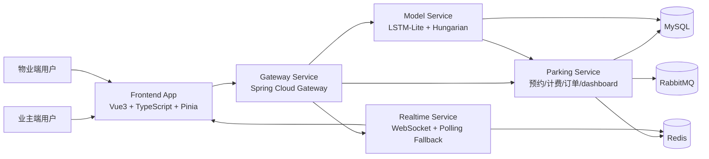
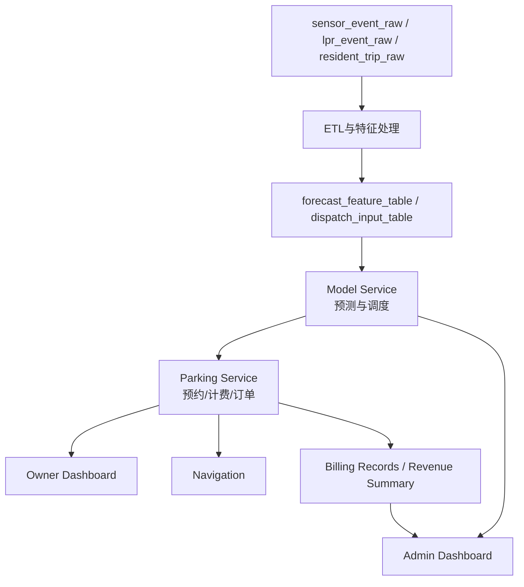
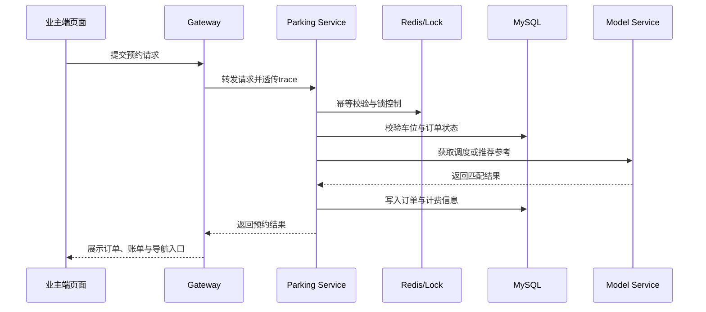
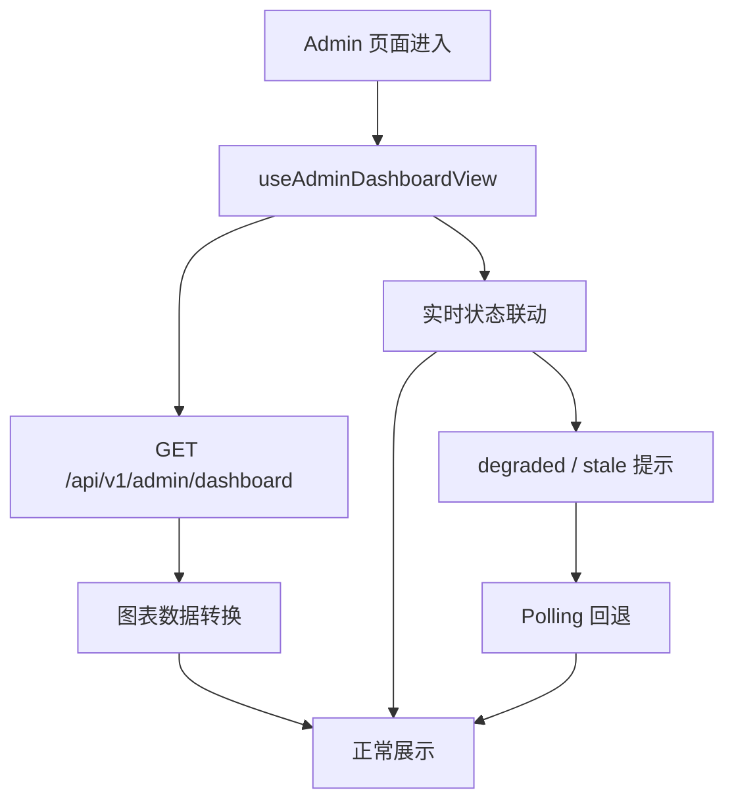
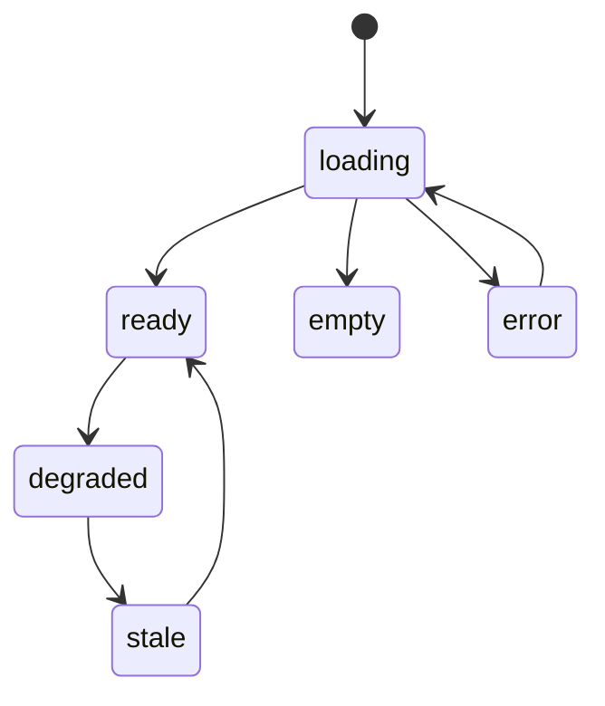
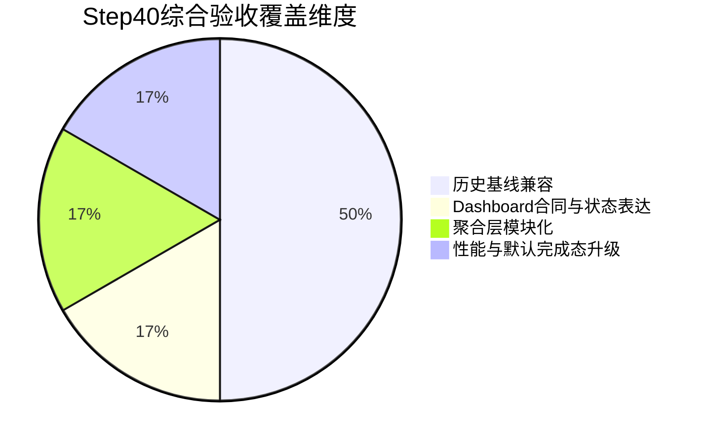

# [学校名称]本科毕业设计说明书

## 中文题目

智慧社区多源数据融合的车位动态调度与共享系统设计

## 英文题目

Design of a Dynamic Parking Dispatch and Sharing System for Smart Communities Based on Multi-Source Data Fusion

## 学院（部）

`[学院（部）]`

## 专业班级

`[专业班级]`

## 学生姓名

`[姓名]`

## 指导教师

`[指导教师]`

## 完成日期

`[完成日期]`

## 摘要

随着城市机动车保有量持续增加，社区停车难、车位信息不透明和停车流程不连贯等问题越来越明显。在实际使用中，很多时候并不是完全没有车位，而是车位状态更新不及时、临时共享缺少统一调度，导致车主找位耗时，物业也难以及时掌握停车资源使用情况。针对这些问题，本文围绕社区停车场景，设计并实现了一套多源数据融合驱动的车位动态调度与共享系统。

本系统采用微服务加前后端分离的总体架构，后端由网关服务、停车主业务服务、模型服务和实时服务组成，前端分别提供业主端和物业端页面。在数据层面，系统整合车位状态、车辆进出记录和住户出行规律等多源信息；在模型层面，采用轻量级 LSTM-Lite 方案对停车供需变化进行估计，并结合 Hungarian 匹配方法完成动态车位分配；在业务层面，打通了推荐、预约、订单、计费、导航和物业经营监控等主要流程；在工程层面，补充了幂等控制、锁机制、消息重试、服务降级和实时回退等设计。

从项目实现结果来看，系统已经完成主要业务链路，并形成了阶段报告、架构文档和综合验收材料。本文的重点不是单独追求复杂模型，而是在本科毕业设计范围内，把数据处理、预测、调度和业务闭环放到同一套系统中进行设计、实现和验证，使课题具备可展示、可复现和可答辩的基础。

关键词：智慧停车，多源数据融合，LSTM-Lite，Hungarian 调度，微服务架构

## ABSTRACT

With the continued growth of urban vehicle ownership, community parking has become a practical problem involving delayed parking-slot updates, low resource utilization, and inefficient user workflows. In many cases, the issue is not the absolute lack of parking spaces, but the lack of timely information and coordinated dispatching. To address this problem, this thesis designs and implements a dynamic parking dispatch and sharing system for smart communities based on multi-source data fusion.

The system adopts a microservice-oriented architecture with separated frontend and backend. It integrates parking-slot status data, vehicle entry and exit records, and resident travel pattern data. A lightweight LSTM-Lite approach is used to estimate parking demand changes, and the Hungarian method is applied to dynamic parking allocation. On the business side, the system supports recommendation, reservation, order tracking, billing, navigation, and admin-side monitoring. On the engineering side, idempotency control, locking, retry, degradation, and realtime fallback are also considered.

The current implementation has completed the main business workflow and corresponding acceptance materials. The thesis focuses on combining data processing, forecasting, dispatching, and business execution into one verifiable undergraduate project instead of pursuing overly complex models.

KEYWORDS: smart parking, multi-source data fusion, LSTM-Lite, Hungarian dispatch, microservice architecture

## 目录

摘要（中文）
ABSTRACT
1 绪论
1.1 研究背景
1.2 研究意义
1.3 国内外研究现状
1.4 本文主要研究内容
2 相关技术与理论基础
2.1 微服务架构与前后端分离
2.2 多源数据融合
2.3 LSTM-Lite 轻量级需求预测
2.4 Hungarian 动态调度方法
2.5 实时交互与可靠性相关技术
3 系统需求分析与总体设计
3.1 系统角色与业务场景分析
3.2 功能需求分析
3.3 非功能需求分析
3.4 系统总体架构设计
3.5 数据流与业务流设计
4 系统详细设计与实现
4.1 服务划分与技术选型
4.2 多源数据接入与处理实现
4.3 预测与调度服务实现
4.4 预约、计费与订单主链实现
4.5 业主端页面实现
4.6 物业端页面实现
4.7 可靠性与降级设计
5 系统测试与结果分析
5.1 测试依据与环境说明
5.2 数据与模型验证
5.3 业务闭环验证
5.4 前端工程化与页面表现验证
5.5 综合验收结果分析
6 结论
6.1 主要结论
6.2 不足与展望
参考文献
致谢

## 1 绪论

### 1.1 研究背景

随着城市化进程不断推进，居民日常出行对机动车的依赖程度越来越高，社区停车问题也变得更加突出。对于社区这种半封闭场景来说，问题往往不是单纯的“有没有车位”，而是“能不能及时知道哪些车位可用”“能不能把空闲资源分配给合适的人”“能不能让停车流程更顺畅”。现实中常见的情况是，一边有车主在场内反复找车位，另一边又有部分共享车位没有被及时利用，这说明停车管理中的信息流和业务流并没有真正打通。

另一方面，物业管理人员也不只是关心当前有没有空位，他们还希望看到收益变化、占用趋势、系统运行状态以及异常时的处理情况。如果系统只能提供一个静态车位列表，实际价值会比较有限。因此，社区智慧停车系统既要解决用户侧的推荐、预约、计费和导航问题，也要兼顾管理侧的经营分析和状态解释能力。

从毕业设计选题角度来看，社区智慧停车是一个比较适合本科阶段完成的综合型题目。它既涉及数据采集和处理，也涉及预测与调度方法，还涉及前后端协同和系统稳定性设计。通过这个课题，可以把平时课程中学到的数据分析、系统设计和工程实现知识放到同一个项目中进行实践。

### 1.2 研究意义

本课题的研究意义主要体现在应用层面和工程层面两个方面。

在应用层面，构建一套智慧社区停车调度与共享系统，有助于提升车位资源利用率，减少车主寻找车位所花费的时间，并改善社区停车流程体验。对于物业管理人员来说，系统能够提供经营摘要、占用趋势和运行状态说明，也有利于提高管理的直观性和及时性。

在工程层面，本课题不是只完成一个简单页面或某个单独算法，而是尝试把多源数据处理、需求预测、动态调度、预约计费导航和经营监控放在同一套系统中完成。通过这一过程，可以更完整地体现数据分析方法与软件工程实践的结合，也更符合本科毕业设计对完整性和可验证性的要求。

### 1.3 国内外研究现状

从现有研究来看，智慧停车相关工作大致可以分为三个方向。第一类工作重点在停车信息采集和状态感知，通过传感器、出入记录或管理平台实现车位状态展示和后台管理。第二类工作更关注停车需求预测，希望通过时间序列分析或机器学习方法预估某一时段的占用情况。第三类工作主要研究车位分配、路径规划和资源调度，目标是在一定约束条件下提升匹配效率。

从系统实现角度看，前后端分离和微服务架构已经成为比较常见的技术路线。后端通常使用成熟的服务框架承载业务逻辑，数据库、缓存和消息机制负责支持订单、状态和统计信息管理；前端则普遍使用现代 Web 框架完成交互展示，并结合地图、图表等组件增强可视化效果。这说明相关研究已经不再停留在单纯的信息展示层面，而是逐步向业务闭环和平台协同方向发展。

不过，很多已有研究仍然偏向单点优化。比如有的系统更强调预测模型效果，但和真实业务流程结合不够紧密；有的系统把主要精力放在页面功能展示上，却没有充分考虑并发控制、异常降级和实时状态管理等工程问题。对本科毕业设计来说，如果只完成局部功能，很难形成一套前后连贯、能够被完整验证的系统成果。因此，本文选择从多源数据融合、轻量预测、动态调度和业务闭环相结合的角度开展设计与实现。

### 1.4 本文主要研究内容

本文主要围绕社区智慧停车系统的设计与实现展开，研究内容包括以下几个方面。

第一，完成多源数据融合设计。系统将车位状态、车辆进出记录和住户出行规律等信息进行整合，为后续预测、调度和经营分析提供数据基础。

第二，完成停车需求预测与动态调度设计。系统使用 LSTM-Lite 对供需变化进行估计，并结合 Hungarian 方法实现动态车位匹配，使预测结果能够真正服务于业务流程。

第三，完成停车业务闭环实现。围绕推荐、预约、订单、计费和导航等主要场景，对业主端页面和后端主链进行联通设计，形成较完整的使用流程。

第四，完成物业端经营监控与状态展示实现。系统通过 dashboard 聚合接口、趋势图表和状态提示，使管理人员能够同时看到经营结果和系统运行情况。

第五，完成系统测试与验收分析。结合架构文档、阶段报告和综合验收材料，对系统在数据、功能、可靠性和工程化方面的表现进行总结。

## 2 相关技术与理论基础

### 2.1 微服务架构与前后端分离

为了让系统职责更清楚、后续扩展更方便，本文采用微服务加前后端分离的实现思路。网关服务负责统一入口和服务治理，停车主业务服务负责预约、计费、订单和 dashboard 聚合等核心功能，模型服务负责预测与调度，实时服务负责状态推送与回退支撑，前端则负责业主端和物业端界面展示。

相比把所有功能都放在同一个应用中的做法，这种结构更适合毕业设计阶段的模块化实现。各模块职责相对清楚，论文写作时也更容易从整体到局部展开说明。同时，前后端分离可以让页面表现和后端逻辑分别组织，便于后续修改和联调。

### 2.2 多源数据融合

本系统的数据基础并不只来自单一车位表，而是综合考虑车位状态、车辆进出记录和住户出行规律等多类数据。通过数据清洗、字段对齐和特征构建，可以形成更适合预测和调度的输入，使系统对社区停车场景的描述更加完整，也让推荐和经营分析不再只依赖某一个瞬时状态。

在社区停车场景中，不同类型数据之间有明显的互补关系。车位状态数据可以反映某个时间点的即时信息，车辆进出记录能够体现历史变化过程，而住户出行规律则有助于描述周期性需求。将这些信息结合起来，能够让后续模型和调度逻辑拥有更稳定的输入基础。

### 2.3 LSTM-Lite 轻量级需求预测

停车场景中的占用变化具有明显的时间相关性，因此本文引入轻量级 LSTM-Lite 方案，对停车供需缺口和区域占用趋势进行估计。这里没有追求特别复杂的模型结构，主要考虑的是本科毕业设计的时间条件、系统可落地性以及和后续业务模块的衔接需求。

对本课题来说，预测模块的价值不只是“给出一个数值结果”，而是为推荐、经营分析和调度决策提供参考信息。因此，轻量化、可复现和易于工程接入，比一味追求复杂模型更符合项目需求。

### 2.4 Hungarian 动态调度方法

在车位分配问题中，系统需要在用户请求和可用车位之间建立匹配关系。Hungarian 方法具有确定性较强、过程较容易解释的特点，适合在毕业设计场景下说明调度思路。本文基于这一方法实现动态匹配逻辑，使系统能够在一定约束下完成车位资源分配。

对于停车系统来说，调度结果不仅要考虑是否有空位，还要考虑区域、状态和业务流程是否能够顺利衔接。Hungarian 方法虽然不是唯一选择，但它在可解释性和实现复杂度之间具有较好的平衡，因此适合作为本课题的调度实现方案。

### 2.5 实时交互与可靠性相关技术

停车业务涉及预约提交、状态更新和异常处理，因此系统在实现中引入了幂等控制、分布式锁、消息重试、服务降级和实时通道回退等设计。与此同时，前端也通过统一页面状态表达来处理 loading、error、empty、degraded 和 stale 等情况。这些设计共同服务于系统稳定性，而不是单独存在的技术堆叠。

对于毕业设计项目来说，可靠性设计的意义在于让系统不仅“能跑通”，还要在遇到异常时保持基本可用。这样做既有助于系统联调和答辩展示，也能体现项目在工程实现层面的完整性。

## 3 系统需求分析与总体设计

### 3.1 系统角色与业务场景分析

本系统主要面向两类角色，分别是业主用户和物业管理人员。不同角色在系统中的关注点不同，因此功能设计也有所区别。

表3-1 系统角色与主要诉求

| 角色 | 主要诉求 | 对应页面或功能 |
| --- | --- | --- |
| 业主用户 | 快速找到合适车位，顺利完成预约、计费和导航 | 推荐页、预约流程、订单页、账单页、导航页 |
| 物业管理人员 | 及时了解经营情况、占用趋势和系统状态 | 物业监控页、趋势图表、实时状态说明 |

资料来源：本文根据项目需求整理。

从具体场景看，业主用户更关注推荐结果是否及时、预约流程是否顺畅、订单与账单信息是否清楚、导航入口是否方便；物业管理人员则更关注经营摘要、收益变化、占用趋势、预测对照和系统状态说明。两类角色目标不同，因此系统在设计时需要兼顾使用效率和管理可视化。

### 3.2 功能需求分析

围绕上述角色，本系统的功能需求可以概括为业主端功能、物业端功能和后台支撑功能三个部分。

表3-2 系统主要功能需求

| 功能类别 | 主要内容 | 作用说明 |
| --- | --- | --- |
| 业主端功能 | 推荐、预约、订单、计费、导航 | 形成停车业务闭环，减少用户重复操作 |
| 物业端功能 | 经营摘要、收益趋势、占用率趋势、预测对照、状态说明 | 帮助管理人员理解业务结果和系统状态 |
| 后台支撑功能 | 数据处理、预测、调度、幂等控制、降级回退 | 保证前台业务能够稳定运行 |

资料来源：本文根据系统设计整理。

业主端主要包括推荐、预约、订单、账单和导航等功能。系统需要尽量减少用户在停车过程中的重复操作，使整个流程更连贯。物业端主要包括经营监控、收益分析、占用率展示、预测对照和实时状态说明等功能，帮助管理人员从业务结果和系统运行两个角度了解停车场情况。

### 3.3 非功能需求分析

除功能需求之外，系统还需要满足一定的非功能要求。首先，关键业务链路要具备基本稳定性，避免并发场景下出现重复处理或资源冲突。其次，系统要有一定可解释性，便于在论文和答辩中说明业务逻辑。再次，系统要具备可复现性，使实验和验收结果能够被重复验证。最后，前端展示需要尽量清楚，异常状态不能只靠隐式失败处理。

从毕业设计实际推进过程来看，非功能需求的重要性并不低于功能需求。因为系统即使功能较多，如果在演示时经常出现状态不一致、页面反馈不清楚或异常场景无法说明的问题，也会影响整体质量。因此，本课题在设计阶段就把稳定性和可解释性作为重要目标之一。

### 3.4 系统总体架构设计

本系统由网关服务、停车主业务服务、模型服务、实时服务和前端应用组成。网关服务负责路由转发、链路追踪和降级兜底；停车主业务服务负责预约、计费、订单、收益统计、导航和 dashboard 聚合；模型服务负责预测和调度优化；实时服务负责 WebSocket 推送和状态伴生能力；前端则分别提供业主端和物业端页面，并使用 Leaflet、ECharts 等组件增强交互效果。

这一架构设计的好处在于，各服务职责比较明确，后续无论是联调、测试还是论文描述，都能按照模块逐步展开。对本科毕业设计来说，这种结构既能体现一定的工程思路，也不会让系统复杂度失控。

表3-3 系统总体架构组成

| 层次 | 主要模块 | 主要职责 |
| --- | --- | --- |
| 接入层 | Gateway Service | 统一路由、链路追踪、熔断降级、跨域处理 |
| 业务层 | Parking Service | 预约主链、计费、订单、导航、dashboard 聚合 |
| 算法层 | Model Service | 供需预测、调度优化、模型版本管理 |
| 实时层 | Realtime Service | WebSocket 推送、实时状态同步、降级伴生能力 |
| 表现层 | Frontend App | 业主端与物业端页面、地图、图表、状态提示 |
| 数据支撑层 | MySQL、Redis、RabbitMQ | 数据存储、缓存控制、消息解耦 |

资料来源：本文根据项目 README 与架构文档整理。

图3-1 系统总体架构图

从图3-1可以看出，系统前端并不是直接访问多个后端服务，而是统一经由网关进入业务服务、模型服务和实时服务。这种方式既保证了接口入口一致，也有利于 trace 透传、异常兜底和后续维护。

### 3.5 数据流与业务流设计

原始车位状态、车辆进出和住户行为数据经过处理后形成预测与调度所需的输入数据。业主请求通过网关进入业务服务，经过幂等控制、锁机制和数据库约束完成一致性处理，再生成预约、计费和订单结果。模型服务负责提供预测和调度支撑，实时服务负责状态同步，最终结果通过业主端和物业端页面呈现出来。

从业务流角度看，业主进入系统后，先根据推荐信息了解可用车位，再完成预约与计费，之后可在订单页查看结果，并进入导航页获取路线信息；物业端则通过 dashboard 接口集中获取经营摘要、趋势数据和状态说明。通过这种方式，系统既有用户侧主流程，也有管理侧监控入口。

图3-2 主数据流与业务流示意图

图3-2说明，本系统的数据流和业务流并不是分离的。ETL 处理后的特征数据会进入预测与调度链路，而调度结果、订单信息和收益统计又会继续反馈到业主端与物业端页面中，形成较完整的闭环。

## 4 系统详细设计与实现

### 4.1 服务划分与技术选型

从项目实现情况来看，系统主要由五个部分组成。第一部分是网关服务，负责统一入口、请求转发和链路管理；第二部分是停车主业务服务，负责预约、订单、计费、导航和 dashboard 聚合；第三部分是模型服务，负责需求预测和调度优化；第四部分是实时服务，负责状态推送和伴生能力；第五部分是前端应用，负责业主端和物业端页面展示。

在技术选型方面，后端服务以 Java 和 Python 为主，前端采用 Vue3、TypeScript、Pinia 和 Vue Router 组织页面逻辑，并结合 Leaflet 地图和 ECharts 图表完成交互展示。这些技术都具有较成熟的工程生态，适合本科阶段完成从实现到演示的完整流程。

表4-1 主要技术选型与作用

| 技术或框架 | 所属部分 | 主要作用 |
| --- | --- | --- |
| Spring Cloud Gateway | 网关服务 | 统一入口、路由转发、降级兜底 |
| Spring Boot | 业务服务 | 承载预约、计费、订单和 dashboard 聚合逻辑 |
| Python 3.11 | 模型服务 / 实时服务 | 预测、调度、WebSocket 实时推送 |
| Vue3 + TypeScript | 前端 | 组织页面结构和交互逻辑 |
| Pinia + Vue Router | 前端 | 状态管理、路由组织 |
| Leaflet + OpenStreetMap | 导航页面 | 页面内地图预览与路线展示 |
| ECharts | 物业端 | 收益、占用率、预测对照等图表展示 |
| MySQL + Redis + RabbitMQ | 数据支撑 | 存储、缓存、消息解耦 |

资料来源：本文根据项目 README 与架构文档整理。

### 4.2 多源数据接入与处理实现

数据处理部分主要围绕车位状态、车辆进出记录和住户出行规律展开。系统首先对不同来源的数据进行清洗和字段对齐，再根据业务需求构建预测和调度所需的中间特征。通过这一过程，系统能够较好地解决不同数据来源格式不一致、时间粒度不同和字段含义分散的问题。

多源数据接入之后，预测服务和业务统计才有比较稳定的输入基础。对本课题来说，这部分实现虽然不直接展示在页面上，但它决定了后续推荐、经营分析和调度模块能否正常工作，因此是整个系统实现的重要前提。

### 4.3 预测与调度服务实现

模型服务主要负责停车需求预测和调度优化。预测部分使用 LSTM-Lite 对供需变化进行估计，给出推荐和经营分析所需的参考信息；调度部分则结合 Hungarian 匹配方法，在用户请求和可用车位之间完成动态分配。这里的重点不是把模型做得越复杂越好，而是让模型结果能够真正进入业务流程。

在实际实现中，预测服务和调度服务并不是完全独立于业务之外运行，而是与停车主业务服务保持协同关系。预测结果可以为推荐和经营图表提供数据参考，调度结果则直接影响车位分配和预约流程。这样的实现方式，使模型不只是一个展示模块，而是进入了系统主链。

图4-1 预测与调度协同流程图

从图4-1可以看到，预测和调度在系统中是前后衔接的。预测结果先给出趋势参考，随后调度模块再结合可用车位完成分配，最后统一进入停车主业务服务和前端页面。

### 4.4 预约、计费与订单主链实现

停车主业务服务是系统中的核心模块，主要承担预约主链、共享计费、订单处理、收益统计、导航目标生成和 dashboard 聚合等职责。考虑到停车预约场景中可能出现重复提交和资源竞争，系统在这一层加入了幂等控制、锁机制和数据库约束等设计，尽量保证主要流程稳定可用。

从业务流程看，用户发起预约后，系统首先校验资源状态和请求有效性，再根据业务规则生成计费结果与订单信息，最后把结果同步到订单页和导航相关页面。这一链路是整个智慧停车系统的核心，也是论文实现部分需要重点说明的内容。

图4-2 业主预约主链时序图

图4-2所展示的处理过程，体现了系统在预约主链中对一致性和业务联动的同时考虑。也就是说，系统不是简单返回“预约成功”，而是把幂等校验、调度参考、订单写入和页面反馈连成了一条完整链路。

### 4.5 业主端页面实现

业主端主要包括推荐、预约、订单、账单和导航等页面。页面设计时不只是考虑展示效果，也考虑停车流程是否连贯。例如推荐页、订单页和导航页需要共享订单上下文，避免用户跳转后丢失主要信息。地图展示采用 Leaflet 加 OpenStreetMap 方案，既能满足页面内预览，也方便后续扩展外部导航跳转。

从用户体验角度看，业主端页面的关键不是单个页面做得多复杂，而是能否把推荐结果、预约操作、订单信息和导航入口连接起来。后期实现中，页面级数据编排被进一步下沉到 view-model 层，这让页面组件本身的职责更加清晰，也使状态切换更容易维护。

### 4.6 物业端页面实现

物业端主要展示经营摘要、收益趋势、占用率趋势、预测对照和实时状态说明等内容。图表部分采用 ECharts 按需加载，减少无关页面的资源开销。相比只堆叠图表，本文更强调对结果来源、更新时间和降级原因的说明，这样管理人员更容易理解页面展示的含义。

在项目后期，owner 和 admin 两类 dashboard 接口被进一步纳入统一合同描述，并对页面级 view-model 进行了收敛。这种做法有两个好处：一是页面所需数据来源更加集中，二是 loading、error、empty、degraded、stale 等状态表达更加统一。对于论文写作来说，这也说明系统在前端工程化方面做了进一步完善。

图4-3 物业端 dashboard 数据编排与状态回退流程图

从图4-3可以看出，物业端页面并不是只请求一次接口后静态展示，而是将 dashboard 聚合数据、实时状态和降级回退策略统一组织到同一套页面编排逻辑中。

### 4.7 可靠性与降级设计

在智慧停车场景中，如果系统只关注正常流程，遇到异常时就很容易出现状态不一致、页面无反馈或请求重复提交等问题。因此，本课题在工程实现中加入了幂等控制、分布式锁、消息重试、服务降级和实时回退等设计。

例如，在实时链路不可用时，系统会通过轮询等方式进行回退，保证页面仍然能够获得基本更新能力；在请求可能重复提交的场景中，系统则通过幂等设计和数据库约束减少重复处理风险。虽然这些设计不会像图表或页面一样直接展示给用户，但它们对系统的稳定运行和答辩演示都很重要。

## 5 系统测试与结果分析

### 5.1 测试依据与环境说明

本课题的测试与分析主要依据项目中的 README、系统架构文档、阶段性证据材料和综合技术验收报告展开。从测试内容上看，既包括数据和模型相关验证，也包括业务闭环、前端工程化和综合验收结果分析。

表5-1 论文测试与分析依据

| 类别 | 主要依据 | 说明 |
| --- | --- | --- |
| 项目总览 | README.md | 用于确认系统组成、模块职责和默认完成态 |
| 架构说明 | memory-bank/architecture.md | 用于确认服务划分、业务链路和接口聚合口径 |
| 证据材料 | reports/thesis_evidence_package.md | 用于整理章节与项目材料的对应关系 |
| 综合验收 | reports/step40_technical_acceptance.md | 用于确认后期合同收敛、聚合层拆分和前端性能优化结果 |

资料来源：本文根据项目现有文档整理。

由于本课题是基于项目资料进行总结与撰写，因此测试环境部分更强调“项目已有实现和验收结果”的归纳，而不是另起一套独立环境重新验证。这样处理也更符合当前毕业论文撰写阶段的实际情况。

### 5.2 数据与模型验证

在数据与模型方面，系统完成了数据质量检查、特征处理、模型训练与对比、模型注册和激活等相关工作，为预测与调度链路提供了基础支撑。虽然本文没有走特别复杂的建模路线，但从项目现有结果来看，轻量化方案已经能够满足系统演示和业务辅助的需要。

从论文写作角度看，这部分结果说明多源数据融合和 LSTM-Lite 预测并不是孤立存在的，而是与整个系统主链发生了联系。预测结果既能进入推荐和经营分析，也能为后续资源调度提供辅助参考，这使模型模块具有了实际业务意义。

表5-2 数据与模型验证内容汇总

| 验证维度 | 主要内容 | 对系统的意义 |
| --- | --- | --- |
| 数据质量 | 原始数据检查、字段清洗、特征整理 | 保证预测与调度输入可靠 |
| 模型训练 | LSTM-Lite 训练与对比 | 提供供需趋势参考 |
| 模型注册 | 版本激活与切换 | 支持后续模型迭代和可追踪性 |
| 结果接入 | 预测结果进入推荐与经营分析 | 说明模型和业务链路已打通 |

资料来源：本文根据项目阶段材料整理。

### 5.3 业务闭环验证

从业务流程角度看，业主端已经能够完成推荐、预约、订单、计费和导航的主要闭环，物业端也能够展示经营摘要、趋势图和状态说明。这说明系统并不是停留在模块级实现，而是已经形成了一套相对完整的业务流程。

在主链验证中，预约和订单处理是关键环节。只有当预约主链、计费规则、订单状态和导航入口能够连起来，系统才算真正具备使用价值。结合项目现有阶段材料可以看出，这条主链已经完成主要打通，并且在一致性设计方面也做了进一步补充。

表5-3 业务闭环验证要点

| 业务阶段 | 主要检查点 | 验证结果概述 |
| --- | --- | --- |
| 推荐 | 是否返回可理解的车位建议 | 已完成推荐页与 dashboard 聚合支撑 |
| 预约 | 是否能够稳定发起并生成订单 | 已完成预约主链联通 |
| 计费 | 是否可形成账单与收益记录 | 已完成共享计费与收益统计 |
| 导航 | 是否可查看目标与路线信息 | 已完成地图预览与导航入口 |
| 物业监控 | 是否可查看经营图表与状态说明 | 已完成 admin dashboard 展示 |

资料来源：本文根据项目实现与验收结果整理。

### 5.4 前端工程化与页面表现验证

随着项目推进，前端部分不仅完成了页面展示，还进一步补充了页面级数据编排、统一状态提示和 dashboard 聚合消费逻辑。这使 owner 端和 admin 端在状态表达上更加统一，也避免了不同页面各自维护一套分散逻辑。

从项目后期结果来看，页面中的 loading、error、empty、degraded、stale 等状态已经能够通过统一组件进行表达。与此同时，图表能力只在 admin 相关页面按需加载，减少了无关页面的资源负担。这些改动虽然属于工程化细节，但对提升页面完整性和答辩演示稳定性都有实际帮助。

图5-1 页面状态统一表达示意图

图5-1反映了前端页面状态管理的统一思路。相比每个页面单独处理提示信息，这种方式更便于维护，也让异常场景在展示上更一致。

### 5.5 综合验收结果分析

在项目后期，系统又进一步补充了 dashboard 接口文档、聚合层模块化、实时通道硬化和前端性能优化等内容，并完成了综合技术验收。验收结果表明，历史稳定基线保持有效，新增加的 dashboard 合同收敛、页面级数据编排、聚合层拆分和图表按需加载等内容也已经通过检查。

综合来看，系统的主要功能、结构设计和工程化能力都具备较完整的答辩支撑基础。对本课题来说，综合验收的意义并不只是“通过了检查”，更重要的是它为论文中的结论提供了相对明确的证据来源，使论文内容能够和项目现有材料形成对应关系。

表5-4 Step40 综合验收结果汇总

| 验收项 | 结果 | 说明 |
| --- | --- | --- |
| Step30 历史增强基线 | 通过 | 历史功能与增强行为保持有效 |
| Step36 发布化稳定能力 | 通过 | 作为稳定锚点继续保留 |
| Step37 现代化入口能力 | 通过 | 首轮现代化改造保持有效 |
| Step38 dashboard 合同与 view-model 收敛 | 通过 | OpenAPI 与页面编排口径一致 |
| Step39 聚合层与性能硬化 | 通过 | 聚合层拆分完成，前端构建无大 chunk warning |
| Step40 默认完成态升级 | 完成 | 默认完成态升级为 Step40 |

资料来源：本文根据《Step40综合技术验收报告》整理。

图5-2 综合验收覆盖维度示意图

图5-2依据 Step40 验收结论中的核心项目整理，反映了本课题在历史兼容、合同收敛、聚合层拆分和性能硬化几个方面都形成了对应的验收覆盖。

## 6 结论

### 6.1 主要结论

本文围绕社区停车难这一现实问题，完成了一套集多源数据融合、需求预测、动态调度、预约计费导航和经营监控于一体的智慧停车系统设计与实现。通过对系统结构、业务流程和工程实现的整理，可以得出以下几点结论。

第一，多源数据融合为停车预测和调度提供了较稳定的基础。将车位状态、车辆进出和住户出行规律等信息结合起来后，系统对社区停车场景的描述更加完整。

第二，LSTM-Lite 预测和 Hungarian 调度能够在本课题中形成较好的配合关系。预测结果为推荐和经营分析提供参考，调度方法则进一步把请求与车位资源进行匹配，使系统不只是展示信息，而是能够参与业务决策。

第三，系统已经形成较完整的业务闭环。业主端能够完成推荐、预约、订单、计费和导航的主要流程，物业端能够完成经营监控和状态说明，这说明课题已经从单点功能实现走向整体系统实现。

第四，系统在工程实现中补充了幂等、锁机制、降级和实时回退等设计，使系统在异常场景下仍能保持基本可用，也增强了项目的答辩展示和验收基础。

### 6.2 不足与展望

虽然本课题已经完成主要业务链和论文整理，但仍然存在一些不足。第一，当前实验规模和复杂场景覆盖还比较有限，整体上更适合社区级演示和工程验证。第二，模型部分采用的是轻量实现路线，后续还可以继续补充更细的特征和更系统的评估。第三，调度策略目前更强调可解释性和确定性，如果后续增加更多业务约束，还可以继续扩展。第四，论文中的横向比较和量化分析仍然可以进一步补强。

如果后续还有继续完善的时间，我认为可以从以下几个方向推进：一是补充更细粒度的实验矩阵和性能对比；二是增强多场景、多时间段的数据验证；三是进一步优化图表说明与管理端解释能力；四是在保证系统可复现性的基础上，继续提升模型与调度模块的适应性。通过这些工作，可以让系统在保持当前完整性的同时，进一步提高分析深度和工程表现。

## 参考文献

[1] 刘汀. 基于 SpringBoot 的微服务体系在企业信息管理系统中的应用[J]. 信息技术与信息化, 2023(05): 23-26.
[2] 马荣彦. Spring Cloud 微服务框架浅析[J]. 现代电影技术, 2021(10): 47-50.
[3] 何毅平, 吴元杰, 陈庚, 朱晓庆. 基于 Spring Cloud 的任务调度微服务化的设计与实现[J]. 信息记录材料, 2021, 22(09): 130-131.
[4] 张宇薇. HTML5 在 Web 前端开发中的应用[J]. 集成电路应用, 2024, 41(04): 274-276.
[5] smart-parking-thesis项目组. 智慧停车系统README说明[R]. 项目内部资料, 2026.
[6] smart-parking-thesis项目组. 系统架构文档[R]. 项目内部资料, 2026.
[7] smart-parking-thesis项目组. 论文证据包[R]. 项目内部资料, 2026.
[8] smart-parking-thesis项目组. Step40综合技术验收报告[R]. 项目内部资料, 2026.

## 致谢

在本课题完成过程中，感谢指导教师在选题、系统设计和论文撰写方面给予的指导与帮助。也感谢在项目实现和材料整理过程中提供支持的老师和同学。通过这次毕业设计，我不仅完成了一个相对完整的系统，也对工程实现、论文写作和答辩准备有了更直接的体会。
